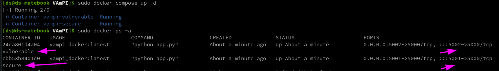
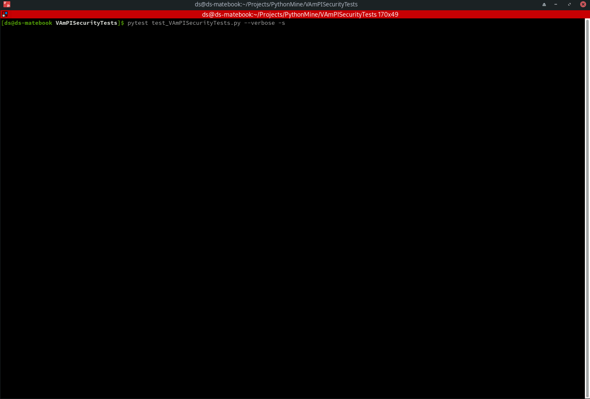

# VAmPISecurityTests
VAmPISecurityTests with python and pytest

## Description:
### PyTest program to test VAmPI https://github.com/erev0s/VAmPI vulnerable REST API with OWASP top 10 vulnerabilities
### This is still in development and will be updated with time.
### Currently tests for:
1. SQL Injection https://erev0s.com/blog/vampi-vulnerable-api-security-testing/#sql-injection
2. Unauthorized password change https://erev0s.com/blog/vampi-vulnerable-api-security-testing/#unauthorized-password-change
3. Mass Assignment https://erev0s.com/blog/vampi-vulnerable-api-security-testing/#mass-assignment
4. Excessive data exposure https://erev0s.com/blog/vampi-vulnerable-api-security-testing/#excessive-data-exposure
5. User and Password Enumeration https://erev0s.com/blog/vampi-vulnerable-api-security-testing/#user-and-password-enumeration
6. Rate Limiting https://erev0s.com/blog/vampi-vulnerable-api-security-testing/#lack-of-resources-amp-rate-limiting
### Currently undone tests:
1. RegexDOS (Denial of service) https://erev0s.com/blog/vampi-vulnerable-api-security-testing/#regexdos-denial-of-service
2. Broken Object Level Authorization https://erev0s.com/blog/vampi-vulnerable-api-security-testing/#broken-object-level-authorization
### Prerequisites
1. pip3 install -U pytest
2. Clone VAmPI
3. Do run inside the VAmPI folder "docker build -t vampi_docker:latest ." as per instructions
4. Do run inside the VAmPI folder "docker compose up -d"
5. This will start VAmPI on port 5002 as vulnerable and on port 5001 as secure.

6. Now do change port variable from inside test_VAmPISecurityTests.py file as wished in order to experiment.

Run with: "pytest test_VAmPISecurityTests.py --verbose -s"

### Demo Vulnerable Gif
### Notes: It is normal for all tests to fail.

### Demo Secure Gif
### Notes: Rate limiting and excessive data exposure seem not to be secure in this case also.
